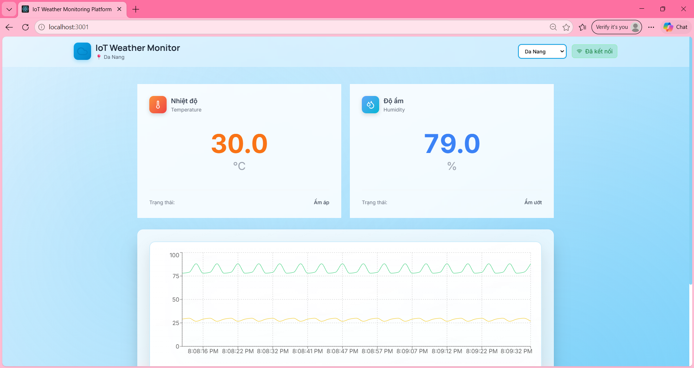

# 🌦 IoT Weather Monitoring Platform

Realtime IoT weather monitoring dashboard built with MQTT, MongoDB, Socket.io and React.

---

## 🚀 Features

* Realtime weather monitoring
* Multi-city support
* MQTT communication
* Realtime dashboard updates
* Temperature & humidity charts
* MongoDB data storage
* Socket.io realtime communication

---

## 🛠 Tech Stack

### Frontend

* ReactJS
* Chart.js
* Socket.io Client

### Backend

* Node.js
* Express.js
* Socket.io
* MQTT

### Database

* MongoDB
* Mongoose

---

## 📡 System Architecture

OpenWeather API
→ Device Simulator
→ MQTT Broker
→ Backend Server
→ MongoDB
→ Socket.io
→ React Dashboard

---

## 🌍 Supported Cities

* Hanoi
* Da Nang
* Ho Chi Minh City

---

## ⚙️ Installation

### 1. Clone repository

```bash
git clone https://github.com/l1ongnguyen11/iot-sensor-platform
```

---

### 2. Install dependencies

#### Backend

```bash
cd backend
npm install
```

#### Frontend

```bash
cd frontend
npm install
```

#### Device Simulator

```bash
cd device-simulator
npm install
```

---

### 3. Start MongoDB

```bash
mongod
```

---

### 4. Start MQTT Broker

```bash
mosquitto
```

---

### 5. Run backend

```bash
cd backend
npm start
```

---

### 6. Run frontend

```bash
cd frontend
npm start
```

---

### 7. Run device simulator

```bash
cd device-simulator
node simulator.js
```

---

## 📷 Dashboard Preview

Realtime monitoring dashboard with:

* city selection
* realtime sensor updates
* temperature & humidity charts

---

## 🔥 Future Improvements

* Authentication system
* Alert notifications
* Docker deployment
* Dark mode
* Historical analytics
* Mobile responsive UI

---

## 👨‍💻 Author

Nguyen Trung Long
