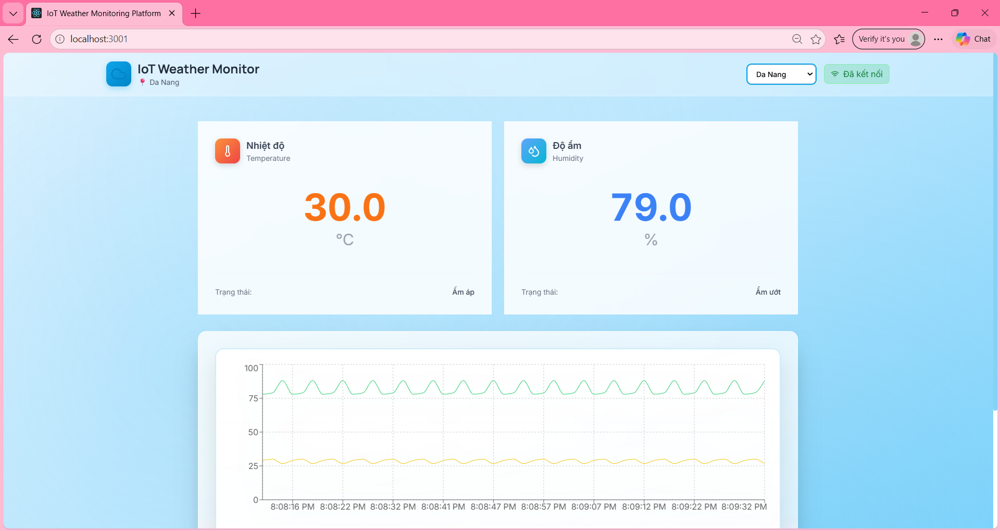

# IoT Weather Monitoring Platform

## Project Overview

Realtime IoT weather monitoring dashboard built with MQTT, MongoDB, Socket.io and React. The system collects sensor data from simulated devices, stores readings in MongoDB, and delivers realtime updates to the React dashboard via Socket.io.

## Architecture

- Device Simulator → MQTT Broker (mosquitto) → Backend (Express + MQTT) → MongoDB → Socket.io → Frontend (React)

## Features

- Realtime sensor streaming
- Multi-city support (Hanoi, Da Nang, Ho Chi Minh)
- Temperature & humidity charts and alerts
- Device registration API

## Tech Stack

- Frontend: React, Chart.js, Socket.io Client, Tailwind CSS
- Backend: Node.js, Express, MQTT, Socket.io
- Database: MongoDB, Mongoose

## Installation

1. Clone repository

```bash
git clone https://github.com/l1ongnguyen11/iot-sensor-platform.git
```

2. Install dependencies

```bash
cd backend && npm install
cd ../frontend && npm install
cd ../device-simulator && npm install
```

3. Start services

```bash
# Start MongoDB (local)
mongod

# Start MQTT broker (mosquitto)
mosquitto

# Backend
cd backend && npm start

# Frontend
cd ../frontend && npm start
```

## Screenshots

Dashboard Preview



## API Endpoints

- `GET /api/devices` — list registered devices
- `POST /api/devices` — register a device
- `GET /api/sensors` — all sensor records
- `GET /api/sensor/city/:city` — latest sensor for a city

## Future Improvements

- Authentication & role-based access
- Push/Email alert notifications
- Docker compose for full-stack deployment
- Historical analytics and export

---

## Author

Nguyen Trung Long
